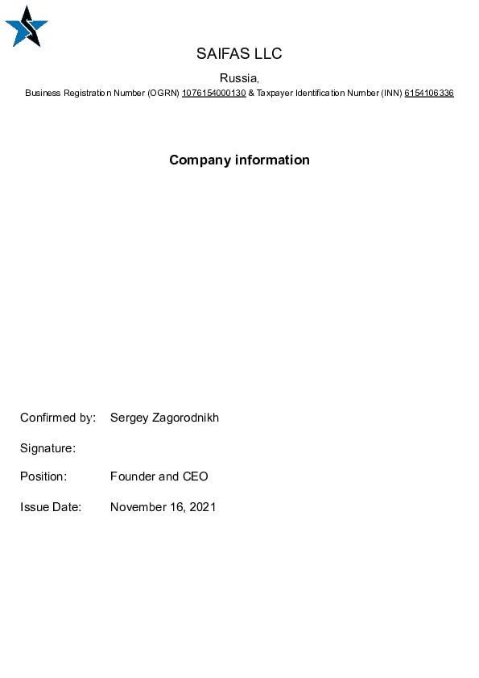

  
Post 1

  
Lorem ipsum dolor sit amet, consectetur adipiscing elit. Phasellus ornare scelerisque sapien vitae mattis. Nunc justo ligula, vestibulum vel gravida nec, fringilla aliquet libero. Nullam libero ex, porta sit amet ante a, commodo hendrerit eros. Cras nulla metus, malesuada nec vulputate ut, convallis sit amet est. Pellentesque quis ligula ut felis suscipit elementum. Praesent suscipit ipsum dolor, vitae mollis massa gravida nec. Aliquam erat volutpat. Nulla ultricies venenatis diam.
  

  
  
  

<a class="btn description-btn" href="/website/app/pages/content/post-details/01/">Содержимое</a>
